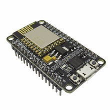

# esp8266-iot-nodemcu

The project has include programs for ESP8266 module.

It does next things:
* Connecting to the defined WiFi Access Point by name and password
* Connecting to the defined MQTT Server
* Sending own power status to the MQTT Server 
* Sending status about a connected lamp
* Reading data light sensor that connected to the analog input
* Sending it to MQTT Server
* Switching on/off a lamp on the dependency of the light sensor
* Receiving commands from MQTT to manipulate with the lamp

The project is my first experience with Lua and NodeMCU. It works together with 
[this](https://github.com/GRomR1/qt-iot-android-app) Android application.

With this program I made an IoT stand that has been demonstrated on the 
[iVolga-2018](http://ivolgaforum.ru/) young people forum.

Many thanks to these projects ([ESPlorer](https://github.com/4refr0nt/ESPlorer) 
and [nodemcu](https://github.com/nodemcu/nodemcu-firmware)). 
With them many defined things make easy.